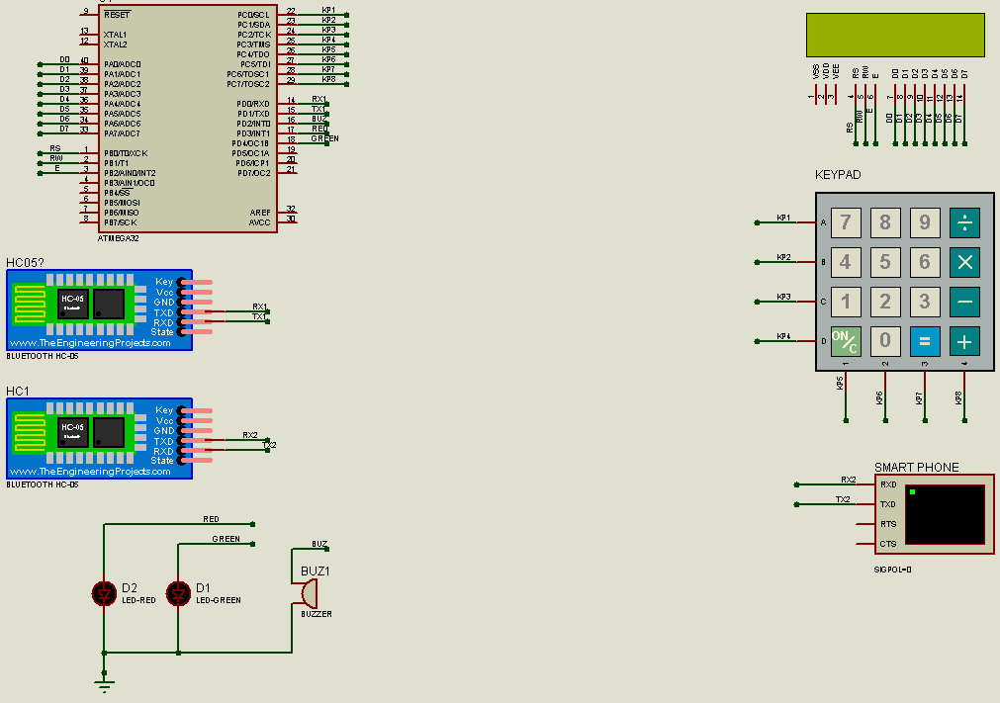

# Safe
Developing an embedded system project employing the __ATmega32__ microcontroller, external EEPROM, LCD, keypad, Bluetooth module, LEDs, and buzzer to construct a secure safe with the capability to send notifications to the owner, enhancing its overall security features.

### How to use
You will need Proteus 8 or later to run the simulation, and make sure you install a [bluetooth library](https://www.theengineeringprojects.com/2016/03/bluetooth-library-for-proteus.html) for Proteus as well as installing [Eltima virtual Serial Port](https://www.eltima.com/products/vspdxp/). Run the __Virtual Serial Port Driver__ and create a pair between 2 ports (COM1 and COM2 by default) then run the simulation in Proteus. You will be asked to set a password at first, then you can use all the functionalities of the safe.

### Features
1. Easy to use interface.
* The ability to store a 4-digit pin.
* The password is stored on the internal EEPROME of the MCU for extra security.
* Include a security alarm to deal with thiefs.
* The state of the locker is sent via bluetooth to the owner.

### Hardware components
1. ATmega32
2. LCD
3. 2x Bluetooth module
4. Keypad
5. Virtual Machine work as smartphone
6. LED (green, red)
7. Buzzer

### Project flow
1. The user is asked to setup a new password
2. LCD shows message "Enter password:"
3. The user enters password "has three tries"
   1. IF correct pass: LCD message "correct passowrd", green LED, message to the owner
      * Then LCD message "Press 1 for change password" 
   3. IF wrong pass: try again on LCD, tries--
      * When tries = 0: red LED, buzzer, message to the owner

### This project was done by a team of 4:
1. [Mahmoud Hossam](https://github.com/Derinkuyu)
2. [Pierre Emad](https://github.com/Pierre-Emad)
3. [Hassan Sherif](https://github.com/hassan17996)
4. Ibrahim Ayman
